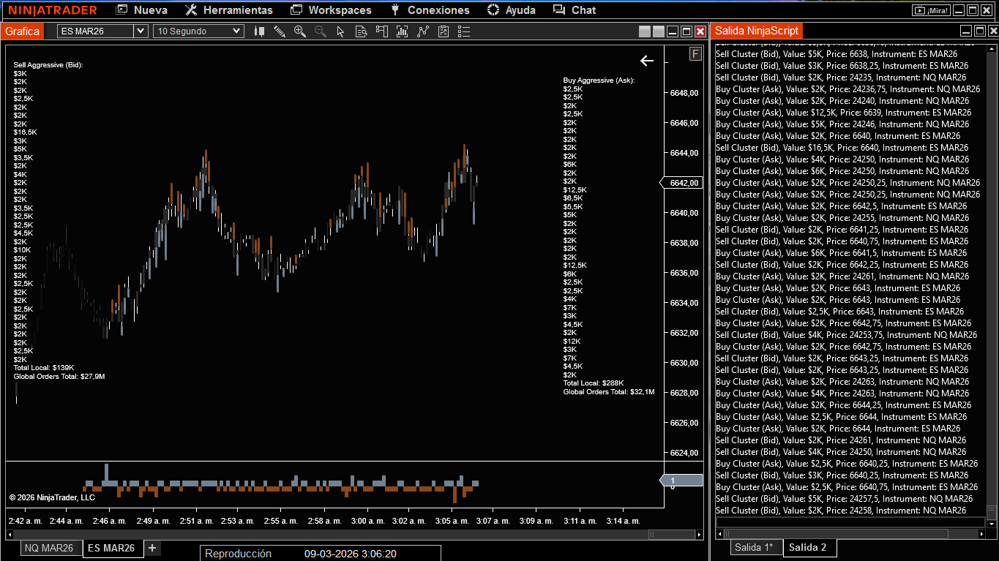
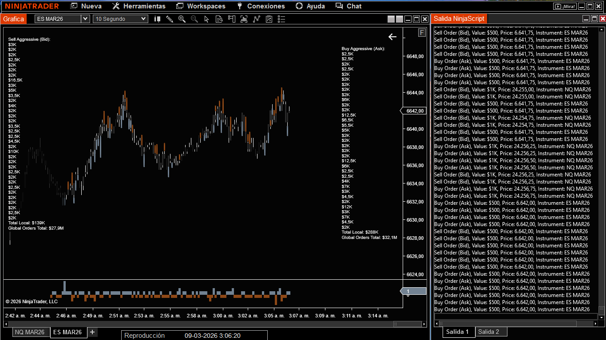

# NT8-Cumulative-Cluster

### 📊 Análisis de Flujo de Órdenes y Acción del Precio

## 🎯 ¿Qué hace este indicador?
Este indicador avanzado de **Order Flow** para NinjaTrader 8 rastrea la agresividad institucional en tiempo real. Su función principal es procesar el volumen y transformarlo en **datos visuales de alta precisión** directamente sobre las velas japonesas.

## 🚀 Funciones Principales en el Gráfico

### 1. Clústeres Dinámicos de Agresividad
El indicador dibuja rectangulos en los puntos donde se detecta una entrada de capital inusual.
* **Inteligencia Visual:** El tamaño y la opacidad de los rectangulos no son fijos; reaccionan proporcionalmente a la intensidad del dinero. A mayor capital, mayor es el rectangulo y más fuerte su color.
* **Métricas de Compra/Venta:** Identifica instantáneamente si la agresividad proviene del *Ask* (compras institucionales) o del *Bid* (ventas institucionales).

### 2. Valores en Cascada (Historial de Clústeres)
En las esquinas superiores del gráfico, el indicador genera una lista vertical en tiempo real con los valores de los últimos 35 clústeres detectados.
* **Lectura de Momentum:** Esta "cascada" de datos permite al trader ver no solo el clúster actual, sino la secuencia de fuerza previa para identificar si el interés institucional está aumentando o disminuyendo.
* **Totales Locales:** Suma automáticamente el valor de esta cascada para darte el volumen total acumulado del movimiento reciente.

### 3. Sincronización Global Multi-Instrumento
* **Cómputo Unificado:** Gracias a su arquitectura, si aplicas el indicador en varios gráficos (ej. ES, NQ, MES, MNQ) (Acciones indices y etf), los valores de **Global Orders Total** sumarán la actividad de todos los mercados simultáneamente.
* **Visión Macro:** Te permite ver el sentimiento total del mercado de índices desde un solo gráfico.

## 🖥️ Monitoreo de Salidas (NinjaScript Output)
Para un análisis profesional exhaustivo, el script envía datos detallados a la consola:
* **Pestaña 1 (Flujo de Órdenes):** Registro de cada orden individual que golpea el mercado.
* **Pestaña 2 (Registro de Clústeres):** Auditoría de los clústeres dibujados, filtrados por el **Output Threshold ($)** para evitar ruido.

## 🛠 Parámetros Técnicos
| Parámetro | Descripción |
| :--- | :--- |
| **Cluster Threshold** | Volumen mínimo necesario para que se genere un clúster visual. |
| **Output Threshold ($)** | Valor monetario mínimo para que una orden o clúster se registre en la consola. |
| **Normalization Multiplier** | Ajusta la sensibilidad visual (mapeo de $ a tamaño de cluster). |
| **Cluster Max Scale** | Tamaño máximo permitido para las rectangulos en el gráfico. |

## 🚀 Instalación
1. Descarga el archivo `CumulativeCluster.cs`.
2. Colócalo en: `Documentos/NinjaTrader 8/bin/Custom/Indicators`.
3. Abre NinjaTrader 8, ve al **NinjaScript Editor** y presiona **F5** para compilar.

---

## ⚖️ Descargo de Responsabilidad y Gestión de Riesgos

**Advertencia de Riesgo:** El comercio de futuros y derivados conlleva un riesgo sustancial de pérdida y no es adecuado para todos los inversores. El rendimiento pasado no es necesariamente indicativo de resultados futuros. El uso de este indicador es bajo su propia responsabilidad y el autor no se hace responsable de las pérdidas financieras derivadas del uso de este software.

**Optimización Estratégica:** Para maximizar la eficacia de esta herramienta, se recomienda integrar el análisis del flujo de órdenes con el estudio de las **griegas de opciones sobre índices**. Comprender el posicionamiento del mercado de opciones permite mejorar significativamente la lectura de la rentabilidad direccional en contratos de futuros, proporcionando un contexto institucional superior al análisis técnico convencional.
